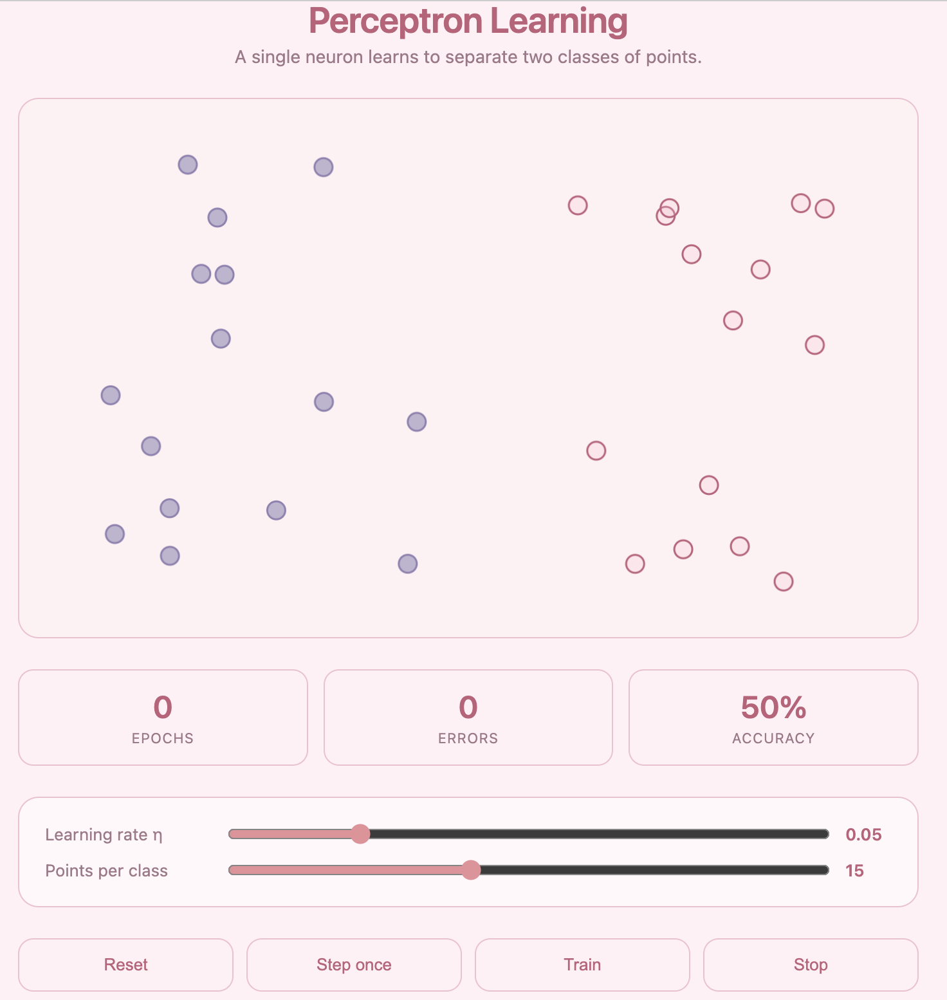

# Perceptron Decision Boundary

An interactive perceptron learning simulator built from scratch using Vite and the Canvas API. A single artificial neuron learns to separate two classes of points by iteratively adjusting its weight vector — rendering the decision boundary live after every epoch.

## What is a Perceptron?

The perceptron, introduced by Frank Rosenblatt in 1958, is the foundational model of supervised binary classification in artificial neural networks. It models a single biological neuron: it receives weighted inputs, sums them, and fires (outputs +1) or remains silent (outputs -1) depending on whether that sum crosses a threshold.

Formally, given an input vector **x** = (x₁, x₂) and weight vector **w** = (w₀, w₁, w₂), the perceptron computes:

**ŷ = sign(w₀x₀ + w₁x₁ + w₂)**

where w₂ is the bias term (equivalent to a constant input of 1). The decision boundary is the hyperplane — in 2D, a line — defined by:

**w₀x₀ + w₁x₁ + w₂ = 0**

All points on one side are classified +1, all points on the other -1.

### Learning Rule

The perceptron learning rule is an online gradient descent algorithm. For each misclassified point, weights update as:

**Δwᵢ = η · (y - ŷ) · xᵢ**

where y is the true label, ŷ is the predicted label, and η is the learning rate. Correctly classified points produce no weight change. This is mathematically equivalent to the Hebbian update rule — weight changes are driven by the product of pre- and post-synaptic activity — and forms the basis of the weight matrix used in the Hopfield network.

### Convergence Theorem

The perceptron convergence theorem (Rosenblatt, 1958; Block, 1962) proves that if the training data is linearly separable, the algorithm is guaranteed to converge to a perfect classification boundary in a finite number of steps. The bound on the number of mistakes is:

**M ≤ (R / γ)²**

where R is the radius of the smallest sphere enclosing the data and γ is the geometric margin of the optimal separating hyperplane.

## Install

```bash
git clone https://github.com/ruedaniels/perception-demo.git
cd perception-demo
npm install
npm run dev
```

Then open http://localhost:5173 in your browser.



## How to Use

- **Train** — runs epochs continuously until 0 errors
- **Step once** — advances a single epoch to observe incremental boundary updates
- **Reset** — samples new random points and reinitialises weights
- **Learning rate η** — controls step size per weight update; higher values converge faster but risk oscillation
- **Points per class** — increases dataset size and margin complexity

## How It Works

Each point is assigned coordinates (x, y) ∈ [0,1]² and a label y ∈ {-1, +1}. The perceptron maintains a weight vector w ∈ ℝ³ (two input weights plus bias). Each epoch iterates over all points:

for each point (x, y, label):
prediction = sign(w · x)
error = label - prediction
if error ≠ 0:
w += η · error · x

The decision boundary `w₀x + w₁y + w₂ = 0` is re-rendered after every epoch. Misclassified points are shown as hollow circles; correctly classified points are solid. Training halts automatically when error count reaches zero.

## Simplifications

- Input space restricted to 2D for geometric interpretability
- Binary bipolar labels {-1, +1} rather than {0, 1} to center the activation function at zero
- Data generated to be linearly separable by construction — left half vs right half of the canvas
- Synchronous batch iteration per epoch rather than true online (stochastic) updates

## Known Limitations

- Cannot classify non-linearly separable datasets — the XOR problem famously demonstrated this limitation (Minsky & Papert, 1969), motivating the development of multi-layer networks
- No convergence guarantee for non-separable data — the boundary oscillates indefinitely
- Single hyperplane boundary only — no kernel trick or feature mapping

## Tech Stack

- Vite
- Vanilla JavaScript
- HTML5 Canvas API

## References

- Rosenblatt, F. (1958). The perceptron: A probabilistic model for information storage and organization in the brain. *Psychological Review*, 65(6), 386–408.
- Block, H.D. (1962). The perceptron: A model for brain functioning. *Reviews of Modern Physics*, 34(1), 123–135.
- Minsky, M., & Papert, S. (1969). *Perceptrons: An Introduction to Computational Geometry*. MIT Press.